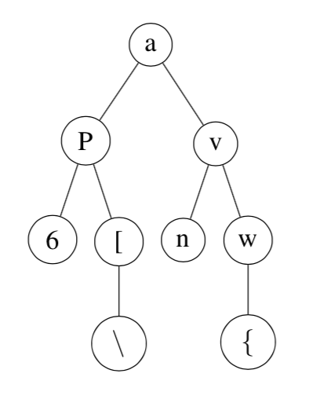
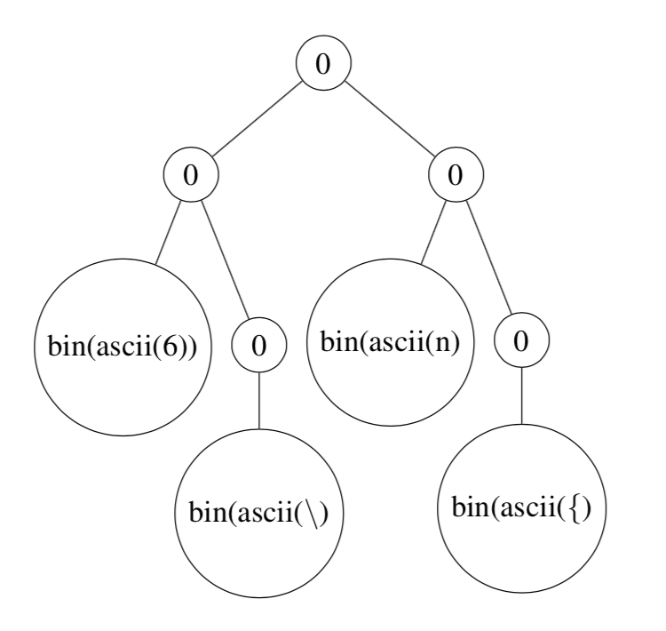

# Binary Tree (A)

## This is an assignment
In this assignment you will be implementing a way to binary representation which requires you to work with binary trees.  
**do not exclude newline character**.

<strong>Please read the entire file and the comments in the files provided before you ask any question.</strong><br>
<strong>You should write your own Makefile to test the code.</strong>


# Learning Goals
You will learn to
* Traversals on a binary tree
* Creating binary representation from character values

# Description of Assignment
This assignment requires you to do the following :
1. Creating binary search tree by calling the function CreateBinarySearchTree. This function takes two inputs, random seed and number of nodes. It creates BST, by randomly choosing ascii values. 
2. Creating a binary representation of the tree. For this part, we will consider that if the tree node is not a leaf node (i.e. have left child or right child) then the binary representation of that node is 0, otherwise the binary representation of the node is binary value of the data it stores. See the example below for better understanding

## Example for this assignment

Let suppose we have a binary tree as follows :



Once we have the tree, now we will convert it into its binary representation. We will be using **pre-order** traversing.
The assignment requires that all the nodes which are not leaf nodes will have binary value as 0 rest will have 1 followed by binary value of the of the ascii value of the data. The last bit after traversal of Tree should be 0 - marking the end of tree.
i.e. for above found tree, the binary representation will be
```
0 0 1binary(ascii(6)) 0 1binary(ascii(\)) 0 1binary(ascii(n)) 0 1binary(ascii({)) 0

which is (Please mind that there are no spaces, they are just there to make it easy to understand):

0 0 100110110 0 101011100 0 101101110 0 101111011 0

```
you can think of it as 

In this Homework you cannot directly write characters to the file. You would have to pack the bits. For eg. If you use the following code:

```
	FILE * outputFilePtr = fopen(“somefile”,”wb”);
	char not_leaf_node = 0;
	fwrite(&not_leaf_node, sizeof(char),1,outputFilePtr);
```

then it writes 00000000 i.e. 8 zeros to the outputFile and not a single bit 0. 

Thus, you would have to have to pack 8 bits before writing it to the file.  Thus for the given example above, if we want to write `0 0 100110110 0 101011100 …….`  to the file. Then the first character will have bit value = `00100110`, which should get printed to the file.


# Functions you need to complete
In this exercise, you have to complete six functions - `CreateBinaryFromTree`, `WritePreOrderBinary`,`CleanTree`, `UnSig2Bin` in `tree.c`; and `main()` in `pa15.c`.
**Do not hardcode the name of the files in your code**
1. `CreateBinaryFromTree` -  This function creates binary representation of input tree by opening the file in binary format and calling WritePreOrderBinary func. The output shoud be saved in a binary file. 
2. `WritePreOrderBinary` - takes input as TreeNode \* and creates binary of the tree as specified in the example. Traversing **pre-order**.
3. `CleanTree` -  This function cleans up the memory allocated for the tree
4. `UnSig2Bin` - This function creates binary from the unsigned char and returns binary value of as strings of the given input. Lenght of this string should be NUM\_BITS, as defined in `tree.h`.
5. `main()` - In this assignment, your main function has the following the specifications.
  1. if the arguments != 4 then print "Wrong arguments\n" and return
  2. 1st input is long value using random seed needed for the generating the binary search tree
  3. 2nd input is long values - which is number of nodes for the binary search tree
  4. If the random seed or number of nodes input is wrong - Print "Wrong inputs\n" and return EXIT_FAILURE
  5. Call CreateBinarySearchTree function to get the tree
  6. If tree is not generated and you get NULL from it, then print "Binary Create Failed \n" and return EXIT_FAILURE
  7. 3rd input is output filename, in which output needs to be printed
  8. if file read fails, free memory and return EXIT_FAILURE

**CreateBinaryFromTree and WritePreOrderBinary together creates the binary representation of the tree. You can use any helper function that you want, if you use helper function, please put them within your #ifndef WRITE\_BINARY definition.**

P.S. :  You can check your expected binary files by using the following command :

```
	xxd -b <yourfilename>
```

example, if we run the command on `expected1.bin` file, we get:


```
0000000: 00010001 00110100 10101001 01000000 01010111 01001011  .4.@WK
0000006: 10100011 01001100 01110110 10011111 01000000           .Lv.@

```


The way to read this is: you can ignore the parts `0000000:` and `0000006: `; also ignore `.4.@WK` and `.Lv.@`. Thus, the binary bits in the file are :

```
00010001 00110100 10101001 01000000 01010111 01001011 10100011 01001100 01110110 10011111 01000000 

```
 

### Function already given to you :
**DO NOT modify this function**

`CreateBinarySearchTree` : this function takes random seed and number of nodes as input and creates binary search tree.

---------------------
# Testing your code
Following are the files we provide:
1. `pa15.c` - main file for this assignment.
2. `pa15.h` - Header file, which has definition for the functions and structures you need in this assignment. Do not modify this file.
4. `tree.h` - Header file, which has definition for the functions and structures you need in this assignment. Do not modify this file.
5. `tree.c` - Define your functions in this file. You can use any helper function you need but do not put them in the header file. Do not modify the functions that we have given you.
5. `expected/` - This directory contains the expected output as generated by the commands shown
	1. `expected1.bin` - ./pa15 125 20 expected/expected1.bin
	2. `expected2.bin` - ./pa15 125 100 expected/expected2.bin
	3. `expected3.bin` - ./pa15 125 1000 expected/expected3.bin
	4. `expected4.bin` - ./pa15 45 200 expected/expected4.bin
	5. `expected5.bin` - ./pa15 79 1200 expected/expected5.bin
	6. `expected6.bin` - ./pa15 67 1160 expected/expected6.bin
	7. `expected7.bin` - ./pa15 23 50 expected/expected7.bin


# Checking for memory errors
You should also run ./pa15 with arguments under valgrind. To do that, you have to use, for example, the following command:
```
valgrind --tool=memcheck --verbose --leak-check=full --log-file=expected/valgrind.log ./pa15 23 50 expected/expected7.bin
```

Note that you should use other input arguments to extensively test your function. If you follow the instructions and keep the malloc and free functions in the right place, you should not have memory problems in this assignment.


# Submitting Your code
** This is a programming assignment, so you would have to submit the code on Blackboard.**

The command to create zip file is as follows:
```

zip HW15.zip pa15.c tree.c

```
<strong>You will not get any credits if the submitted file is not zipped</strong>

The **only** way to submit homework is through Blackboard.

The instructor will **never** accept any requestion for exception "*my
submission is only one minute late*".  It is your responsibility to
meet the deadline.  You are strongly encouraged to submit at least ten
minutes before the deadline because submission may take time.

If there is a campus-wide problem (such as network outage or the
Blackboard server is down), the deadline will be extended for the
entire class. If the problem is specific to yourself (for example,
your computer crashes), the deadline will not be extended for
you.

**DO NOT** send your code by email. Your code will not be graded
  if it is sent by email.

The teaching staff is strictly prohibited to look at files on your
computer (or your Purdue account) for grading. Thus, **NEVER** say "I
finished before the deadline but I forgot to submit".  **NEVER** say "I have
not made any change after the submission deadline." because the
teaching staff is not allowed to look at your files that have not been
submitted through Blackboard.


# Grading
If your program has any compilation error or warning (remember to use
`gcc -std=c99 -g -Wall -Wshadow --pedantic -Wvla -Werror`), you will
receive zero in this assignment.

In absolutely no circumstance can the teaching staff modify your
program for grading.  You cannot say, "If you change this, my program
works." If your program misses a semicolon and cannot compile, you
will receive zero.  Your score depends on what is submitted, nothing
else.

**The grading test cases will be made available along with the grades**
